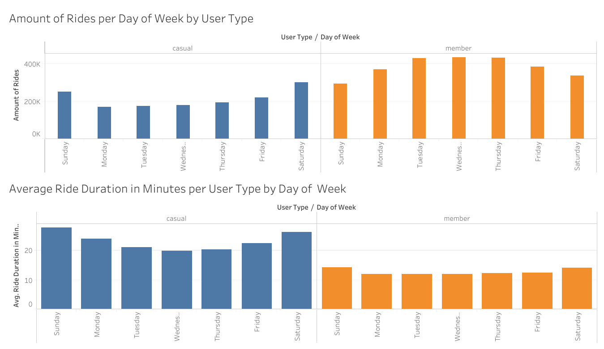

### This notebook is for a case study for the **Data Analysis Professional Certificate** imparted by **Google** through **Coursera**.

In this notebook you will be able to find the following deliverables for the case study:

1.  A clear statement of the business task.

2.  A description of all data sources used.

3.  Documentation of any cleaning or manipulation of data.

4.  A summary of your analysis.

5.  Supporting visualizations and key findings.

6.  Your top three recommendations based on your analysis

This fictional company have a very important task to be done. The director of marketing believes the company’s future success depends on maximizing the number of annual memberships. We need to properly understand how casual riders and annual members use **Cyclistic** bikes differently.

Based on that we proceeded to Prepare the data for Analysis. This was done using the dataset provided by the course managers which is provided by Divvy in the following link: [Click here to access the dataset.](https://divvy-tripdata.s3.amazonaws.com/index.html). This dataset have information of the last few years, so we decided to work with 2023 data.

In the Ask phase we found that question to be answered is:

-   How do annual members and casual riders use **Cyclistic** bikes differently?

We then added two columns to obtain more data about the rides. These columns are:

-   ride_length = ended_at - started_at

    ```{r Creating_ride_length_column, eval=FALSE}
    #Create column ride_length in seconds
    X2023_divvy_tripdata$time_diff_mins <- difftime(X2023_divvy_tripdata$ended_at, X2023_divvy_tripdata$started_at, units = "mins") X2023_divvy_tripdata$ride_length <- as.numeric(X2023_divvy_tripdata$time_diff_mins) %% 60 X2023_divvy_tripdata <- select(X2023_divvy_tripdata, -time_diff_mins) X2023_divvy_tripdata$ride_length <- X2023_divvy_tripdata$ride_length * 60
    ```

-   day_of_week = weekday(ended_at)

    ```{r Creating_day_of_week_column, eval=FALSE}
    #Create column day_of_week 
    X2023_divvy_tripdata <- X2023_divvy_tripdata %>%   mutate(day_of_week = weekdays(ended_at))
    ```

This data was fairly clean and usable but to be able to do a proper analysis of the provided data we did the following:

-   Installed the needed packages.

    ```{r Import_Packages, eval=FALSE}
    install.packages("tidyverse")# install the tidyverse package

    library(stringr) # Load the stringr package
    library(tidyverse)# Load the tidyverse package
    ```

-   Added all datasets into one to have all year's data.

    ```{r Merging_Datasets, eval=FALSE}
    #Add the 12 datasets into one 
    X2023_divvy_tripdata <- rbind(X202301_divvy_tripdata, X202302_divvy_tripdata, X202303_divvy_tripdata, X202304_divvy_tripdata, X202305_divvy_tripdata, X202306_divvy_tripdata, X202307_divvy_tripdata, X202308_divvy_tripdata, X202309_divvy_tripdata, X202310_divvy_tripdata, X202311_divvy_tripdata, X202312_divvy_tripdata)
    ```

-   Normalized station names, deleting any extra signs and symbols.

    ```{r Normalizing_Station_Names, eval=FALSE}
    #Deleted all asterisks at the end of each start_station_name
    X2023_divvy_tripdata$start_station_name <- ifelse(
      str_ends(X2023_divvy_tripdata$start_station_name, "\\*"),  # Check if ends with asterisk
      substr(X2023_divvy_tripdata$start_station_name, 1, nchar(X2023_divvy_tripdata$start_station_name) - 1),  # Substring if true
      X2023_divvy_tripdata$start_station_name)  # Keep original value if false

    #Deleted all asterisks at the end of each end_station_name
    X2023_divvy_tripdata$end_station_name <- ifelse(
      str_ends(X2023_divvy_tripdata$end_station_name, "\\*"),  # Check if ends with asterisk 
      substr(X2023_divvy_tripdata$end_station_name, 1, nchar(X2023_divvy_tripdata$end_station_name) - 1),  # Substring if true
      X2023_divvy_tripdata$end_station_name)  # Keep original value if false
    ```

-   Filtered out all rides that had any "NA" values.

    ```{r Handling_NA_Values, eval=FALSE}
    #Delete all rides that have an NA value in any columns 
    X2023_divvy_tripdata <- na.omit(X2023_divvy_tripdata) 
    ```

-   Filtered out all rides that lasted less than 2 minutes.

    ```{r Handling_Short_rides, eval=FALSE}
    #Filter out rides that lasted less than 2 minutes 
    X2023_divvy_tripdata <- X2023_divvy_tripdata[X2023_divvy_tripdata$ride_length >= 120, ]
    ```

Once we have that settled we proceed and Analyze the data. For this step I proceeded to export the dataset to Tableau to be able to create some graphics that show valuable information.

As summary of the analysis, we were able to see how each type of member behave differently. If you would like to access the Dashboard and explore is published in Tableau Public. [Click here to access the dashboard.](https://public.tableau.com/views/CyclisticCaseStudy_17157317913370/Dashboard1?:language=en-US&publish=yes&:sid=&:display_count=n&:origin=viz_share_link)



Based on these two graphics we can point out several points:

-   There's an increase of rides in the weekends for casual users that is almost equal to the ones made by members.

-   Members did not made as many rides in the weekends as in the weekdays.

-   Rides made by casual users lasted longer that the ones made by members.

-   Longer rides happened in weekends.

From this, I can recommend the director of marketing the following:

-   Launch a campaign that shows the advantages of using Cyclistic on weekdays for casual users. These advantages can be such as: less time committing to work, healthier habits, less money spend on gas or public transportation, etc.

-   Encourage members to use the bike for longer. Introducing new use cases for the bikes through promotions, videos or graphics.

-   To integrate casual users with the company launching promotions and activities throughout the week, etc.

This case study successfully analyzed ridership data from Cyclistic to understand how casual riders and annual members utilize the bike-sharing service differently. By leveraging data cleaning techniques and visualizations, we identified key trends in ride frequency, duration, and day of the week.
